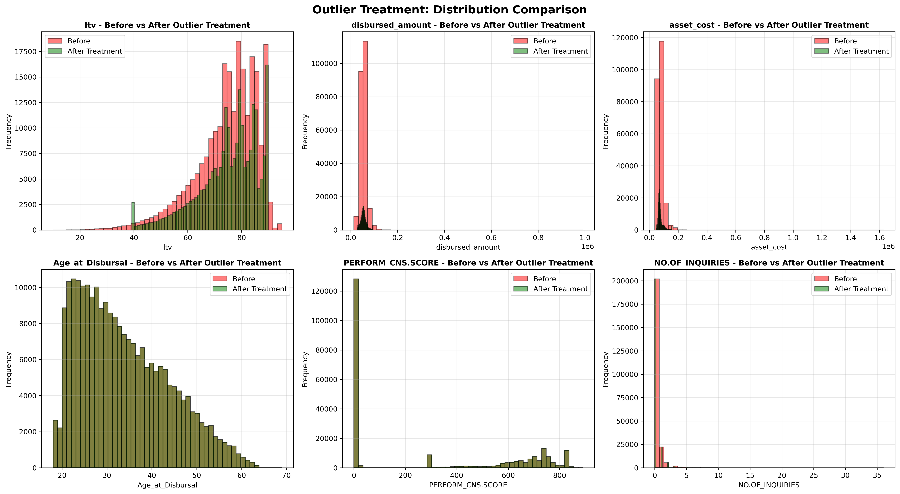
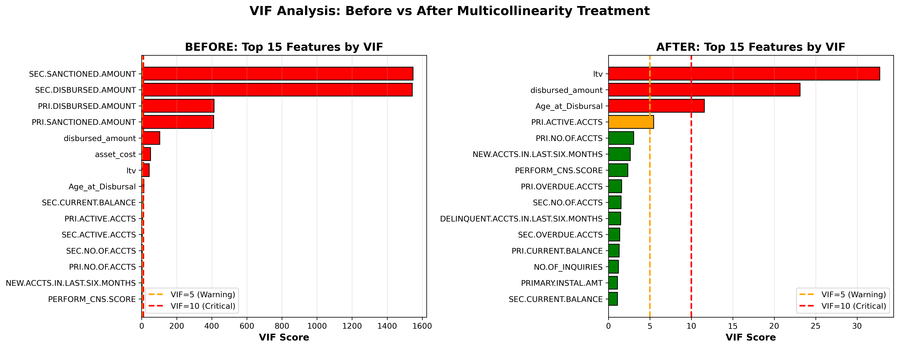

# Vehicle Loan Default Risk Modelling

This project aims to predict the risk of default on vehicle loans using historical data. The development process includes comprehensive EDA, rigorous feature engineering (including WOE/IV and VIF analysis), and a stacking ensemble approach for robust prediction.

---

## 1. Project Overview
Vehicle loan defaults represent a significant financial risk for lenders. By predicting the likelihood of default at the time of disbursement, financial institutions can optimize their credit risk assessment and approval strategies. This project implements a full machine learning pipeline—from raw data cleaning to advanced ensemble modeling—to classify borrowers as potential defaulters or non-defaulters.

## 2. Data Description
The dataset encompasses several key dimensions of borrower information:
- **Demographics:** Age, employment type, location, and professional background.
- **Financial Metrics:** Disbursed amount, asset cost, LTV (Loan to Value), and installment amounts.
- **Credit History:** Bureau scores, total accounts, delinquency history, and primary/secondary account details.
- **Target Variable:** `loan_default` (1 = Default, 0 = Non-default).

## 3. EDA Highlights
The Exploratory Data Analysis phase focused on identifying data quality issues and understanding default drivers:
- **Class Imbalance:** Approximately 21% of borrowers defaulted. This imbalance was addressed during modeling using the `scale_pos_weight` parameter in XGBoost.
- **Skewness Correction:** The `disbursed_amount` feature exhibited high right-skewness (≈ 4.49). A **Log Transformation** reduced this to -0.45, improving model stability.
- **Data Cleaning:** Cleaned tenure-related features and handled missing values in `Employment.Type` by classifying them as 'Unemployed'.



## 4. Feature Engineering & Selection
Technical rigor was applied to feature selection to ensure model generalizability:
- **Weight of Evidence (WOE) & Information Value (IV):** Used to quantify the predictive strength of features. Features with low IV were pruned.
- **Multicollinearity Analysis (VIF):** Variance Inflation Factor analysis was performed to identify and remove highly correlated features, particularly those derived from bureaucratic and financial totals.
- **Temporal Analysis:** Extracted borrower age and loan aging from date columns, correcting 2-digit year representations.



## 5. Model Development
### Advanced Modeling (XGBoost)
A highly regularized XGBoost model served as the primary learner:
- **Hyperparameter Tuning:** Optimized via `RandomizedSearchCV` over 50 iterations.
- **Key Parameters:** `learning_rate=0.05`, `max_depth=8`, `subsample=0.7`, `colsample_bytree=0.8`.
- **Metrics:** Achieved an **ROC-AUC of 0.65** and an **Average Precision of 0.33**.

### Stacking Ensemble Architecture
To increase predictive robustness, a **Stacking Ensemble** was designed:
- **Base Learners:** XGBoost, Random Forest, and Logistic Regression.
- **Meta-Learner:** Logistic Regression (used to aggregate the predictions of base learners).
- **Conclusion:** While individual models performed strongly, the ensemble provided a more consistent classification across diverse borrower segments.

## 6. Model Interpretability (SHAP)
Model transparency was achieved using **SHAP (SHapley Additive exPlanations)**:
- **Global Importance:** Identified `LTV`, `Bureau Score`, and `Disbursed Amount` as the most significant features.
- **Decision Logic:** SHAP Summary plots visualize how specific feature values increase or decrease the probability of default.

## 7. Results & Evaluation
The model's decision threshold was optimized to **0.47** to maximize the F1-score, ensuring a business-aligned balance between identifying risky borrowers and approving safe loans.

| Metric | Performance |
| :--- | :--- |
| **ROC-AUC** | 0.65 |
| **PR-AUC** | 0.33 |
| **Optimal Threshold** | 0.47 |

---

## How to Run
1. **Clone the repository:**
   ```bash
   git clone https://github.com/Manukumar9319/vehicle-loan-default-risk-modelling.git
   ```
2. **Install dependencies:**
   ```bash
   pip install -r requirements.txt
   ```
3. **Explore Notebooks:**
   - EDA: `notebooks/01_v2_comprehensive_eda.ipynb`
   - Modeling: `model_development/02_advanced_modeling.ipynb`
   - Stacking: `model_development/05_stacking_ensemble.ipynb`

---